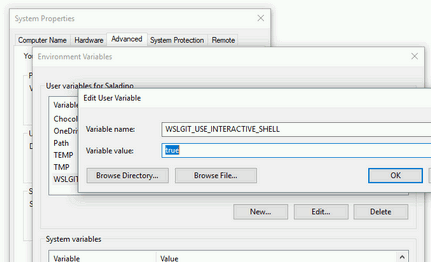

# WSLGit

[](https://travis-ci.org/hangxingliu/wslgit)

Use Git installed in WSL(windows Subsystem for Linux) from Windows and Visual Studio Code.

The project was inspired by [A. R. S.](https://github.com/andy-5)'s project [andy-5/wslgit](https://github.com/andy-5/wslgit) written by Rust.   
But why do I re-implement it by scripts, because I hope the wslgit tools could support any mount points (but not only under the `/mnt/`) and could be used without compiling.

## Usage

1. Please ensure `git` is installed in your WSL.
2. Copy `wslgit.sh` to the `/usr/bin/` or `~/bin` directory in your WSL.
3. Add the following config into your VSCode Settings.
	- `{ "git.path": "C:\\path\\to\\git.bat" }`

### 🐢 Feeling slowly? (Disable interactive shell)

wslgit launch git installed in WSL in interactive shell mode by default now.   
In short, the `ssh-agent` setup in `.bashrc` script is supported. but slower then non-interactive mode.

If you want disable interactive shell to reduce launch time, you can set Windows environment variable `WSLGIT_USE_INTERACTIVE_SHELL` to `false`.

#### via GUI



#### via Powershell

``` powershell
[System.Environment]::SetEnvironmentVariable("WSLGIT_USE_INTERACTIVE_SHELL", "false", "User")
```


## Update

### 2019-04-16

1. Fixed bug caused by Windows 10 19H1 changed the output of `mount` command 
	- Related pull request: <https://github.com/hangxingliu/wslgit/pull/13> (Thanks @kiroushi)
	- Related issue: <https://github.com/hangxingliu/wslgit/issues/10>

### 2019-03-11

1. **BREAKING CHANGE:** Start git installed in WSL in interactive mode. 
	- If you want to use non-interactive mode, **just like before**: Set Windows env variable `WSLGIT_USE_INTERACTIVE_SHELL` to `true`.
2. Fixed error in the unix path to win path convert function.
	- Related issue: <https://github.com/hangxingliu/wslgit/issues/11> (Thanks @rennex)
3. Added path converting for the output of `git init`


[CHANGELOG](CHANGELOG.md)

## Under the hood

### How does it work

1. Pass all arguments and env variable `WSLGIT_SH_CWD` into `wslgit.sh` in WSL when you or VSCode execute `git.bat`.
2. Get all mounted drive info by `mount -t drvfs` command in `wslgit.sh`.
3. Move cwd(current working directory) to `WSLGIT_SH_CWD`.
4. Iterate arguments, and replace each path argument from Windows style to Linux style by reference to mounted drive info.
5. And convert the path in the git output to Windows style if git arguments included special keywords/actions. (Eg. `rev-parse`, `remote`)
6. Why the it doesn't use `wslpath` for path convert, please reference to the test case: [test-win/main.js](test-win/main.js)


### How to test it

- Automatic test on Linux (also WSL): [test-ci/main.sh](test-ci/main.sh)
- Semi-automated test on Windows: [CONTRIBUTING.md](CONTRIBUTING.md)

### How to contribute (issue/pull request)

[CONTRIBUTING.md](CONTRIBUTING.md)

## Related links

- <https://github.com/andy-5/wslgit>
- <https://blogs.msdn.microsoft.com/commandline/2017/11/28/a-guide-to-invoking-wsl/>

## Author

[LiuYue (@hangxingliu)](https://github.com/hangxingliu)

## Contributors

- [@kiroushi](https://github.com/kiroushi)
- [Joao Paulo Luigi Luiz (@joaopluigi)](https://github.com/joaopluigi)
- [@rennex](https://github.com/rennex)

## License

[GPL-3.0](LICENSE)
